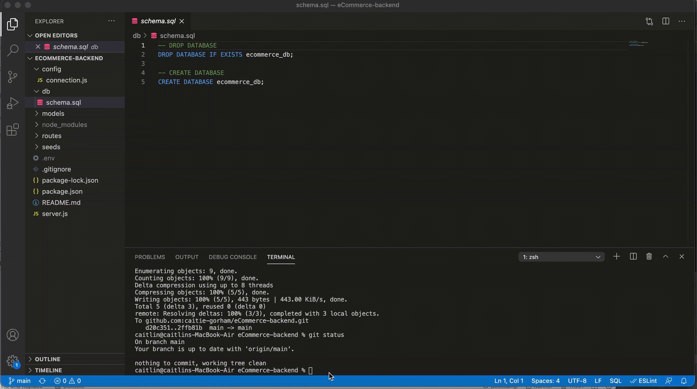

# eCommerce Database Creation and Management

## Table of Contents 

* [Overview](#Overview)
* [Access](#Access)
* [Questions](#Questions)

# Overview
This is a CLI application that has routes to get, post, put and delete attributes for four tables within an eCommerce mySQL database. Below are screen captures of each step of the databse management allowed through the CLI application.

### Create Database
 

### Seed the Database

### Start the Server

### Get Routes for Products, Tags and Categories

### Get Routes by ID for Products, Tags and Categories

### Put, Post and Delete Routes for Categories

### Put, Post and Delete Routes for Products

### Put, Post and Delete Routes for Tags

# Access

You can find the GitHub repo here: https://github.com/caitie-gorham/eCommerce-backend

# Questions
Project Created By: Cait Gorham

GitHub User Name: caitie-gorham

Email: em.caitie@gmail.com